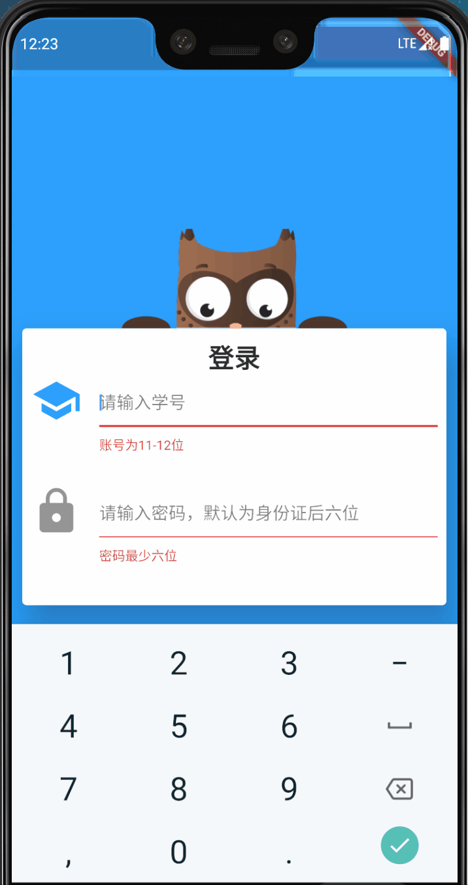

# flutter_owlAnimation

一个flutter捂眼动画的实现


## 效果演示：



## 如何使用


1. 下载 [owl.dart](https://github.com/36k/flutter_owlAnimation/tree/master/owl/lib/widgets)文件

2. 将静态资源文件导入您的静态资源文件夹

3. 修改引用静态资源的代码为您的资源路径

4. 调用相关api使用

   

## 相关api

```dart
final OwlAnimation owlAnimation = OwlAnimation();
//关闭眼睛
 owlAnimation.closeEye();
//打开眼睛
 owlAnimation.openEye();
```

## 引用说明

> 使用了[Zws-China](https://github.com/Zws-China)的素材
